<div align="center">

# 🍬 Product Line Profitability & Margin Performance Analysis
### Nassau Candy Distributor

*Turning transactional sales data into product- and division-level profitability intelligence.*

[](https://www.python.org/)
[](https://streamlit.io/)
[](https://pandas.pydata.org/)
[](https://plotly.com/)
[](https://jupyter.org/)

**[🚀 Live Dashboard](https://candy-distributor-analysis.streamlit.app/)**

</div>

---

## 📑 Table of Contents

- [Overview](#-overview)
- [Business Problem](#-business-problem)
- [Project Objectives](#-project-objectives)
- [Dataset](#-dataset)
- [Analytical Methodology](#-analytical-methodology)
- [Dashboard Features](#-dashboard-features)
- [Dashboard Preview](#-dashboard-preview)
- [Exploratory Data Analysis](#-exploratory-data-analysis)
- [Key Business Insights](#-key-business-insights)
- [Business Recommendations](#-business-recommendations)
- [Technology Stack](#-technology-stack)
- [Repository Structure](#-repository-structure)
- [Documentation](#-documentation)
- [Installation](#-installation)
- [Running the Application](#-running-the-application)
- [Acknowledgements](#-acknowledgements)
- [Contact](#-contact)

---

## 📌 Overview

Nassau Candy is one of the largest U.S. wholesale manufacturers and distributors of specialty and private-label confections, supplying national retailers and independent stores through a portfolio of over 20,000 SKUs. At this scale, sales volume alone is a misleading measure of success — a product can move significant volume while quietly eroding margin.

This project builds a complete profitability analysis pipeline for Nassau Candy: from data cleaning and KPI engineering in Python, through structured exploratory analysis in Jupyter, to an interactive Streamlit dashboard that lets stakeholders drill into product-level margins, division performance, profit concentration, and cost risk in real time.

> 💡 The goal isn't "which products sell the most" — it's **"which products actually make money, and where is that profit at risk."**

---

## ❗ Business Problem

Nassau Candy currently lacks a consolidated, data-driven view into:

- Which product lines deliver the highest gross margin
- Whether high-sales products are actually profitable
- How profitability varies across product divisions
- Which products represent margin risk

Without this insight, decisions on pricing, promotions, and product portfolio management remain reactive and intuition-based rather than evidence-based.

---

## 🎯 Project Objectives

- Identify product categories that contribute the highest gross margin
- Detect margin-risk items (high cost relative to sales, thin or negative margins)
- Measure profit concentration across products and divisions
- Provide prioritized, data-driven recommendations for portfolio and pricing decisions

---

## 🗂️ Dataset

**File:** [`Nassau_Candy_Distributor.csv`](Nassau_Candy_Distributor.csv)

The dataset contains **10,194 transaction-level records across 18 fields**, where each row represents a single product sold within a specific order on a specific date.

| Field | Description |
|---|---|
| Row ID | Unique row identifier |
| Order ID | Unique order identifier |
| Order Date | Date of order |
| Ship Date | Date of shipment |
| Ship Mode | Shipping method of order |
| Customer ID | Unique customer identifier |
| Country/Region | Country or region of customer |
| City | City of customer |
| State/Province | State/province of customer |
| Postal Code | Postal code / zip code of customer |
| Division | Product division (Chocolate, Sugar, Other) |
| Region | Region of customer |
| Product ID | Unique product identifier |
| Product Name | Product long name |
| Sales | Total sales value of order |
| Units | Total units of order |
| Gross Profit | Gross profit of order (Sales − Cost) |
| Cost | Cost to manufacture |

**Business context:** the portfolio spans three product divisions — **Chocolate**, **Sugar**, and **Other** — each of which is supplied by a dedicated factory (e.g., Wonka Bar products from *Lot's O' Nuts* and *Wicked Choccy's*, sugar confections from the *Sugar Shack*), giving the analysis a real supply-chain dimension alongside the pure financial view.

---

## 🔬 Analytical Methodology

The analysis follows a structured, four-stage methodology:

### 1. Data Cleaning & Validation
- Removed exact duplicate rows
- Parsed and validated `Order Date` and `Ship Date`
- Coerced `Sales`, `Cost`, `Units`, and `Gross Profit` to numeric types and removed zero/negative values
- Cross-validated `Gross Profit` against the computed `Sales − Cost` difference
- Standardized `Division` and `Product Name` text to consistent title case

### 2. Profitability Metric Engineering
| KPI | Formula |
|---|---|
| Gross Margin (%) | Gross Profit ÷ Sales × 100 |
| Profit per Unit | Gross Profit ÷ Units |
| Revenue Contribution (%) | Product/Division Sales ÷ Total Sales × 100 |
| Profit Contribution (%) | Product/Division Profit ÷ Total Profit × 100 |
| Profit-Revenue Gap (%) | Profit Contribution − Revenue Contribution |
| Margin Volatility | Standard deviation of monthly margin % |
| Cost Ratio | Cost ÷ Sales |

### 3. Product & Division-Level Analysis
- Ranked products by gross profit and gross margin to separate primary profit drivers from margin-efficient products
- Classified products into strategic quadrants (Stars, Volume Traps, Niche Opportunities, Exit Candidates) based on sales and margin medians
- Aggregated metrics by division to compare revenue vs. profit contribution and flag structural margin imbalances

### 4. Pareto & Cost Structure Diagnostics
- Applied Pareto (80/20) analysis to quantify revenue and profit concentration across the product portfolio
- Built a cost-vs-sales scatter analysis with a break-even reference line to flag cost-heavy, margin-poor products
- Flagged products for review where gross margin fell below 5% or cost ratio exceeded 0.90

---

## 🖥️ Dashboard Features

The Streamlit application (`streamlit_app.py`) is organized into five modules, navigable from the sidebar, with global filters for **Product Search**, **Division**, **Margin Risk Threshold**, and **Date Range**.

### 📊 Overview
Portfolio-wide KPI summary — gross margin (donut chart), total sales and gross profit, profit per unit (gauge), units sold, and margin volatility (rolling standard deviation trend). Includes a revenue vs. gross profit trend chart over time.

### 💰 Product Profitability Overview
Total product count, average product margin, and top profit-generating product. A configurable leaderboard lets users rank products by Gross Margin (%), Gross Profit, Sales, Units, or Profit per Unit, with an adjustable number of products shown. Includes a revenue-vs-profit contribution comparison and a portfolio positioning scatter plot classifying products into High/Low Revenue × High/Low Margin quadrants.

### 🏢 Division Performance
Top division by revenue and profit share, a revenue-vs-profit contribution bar chart by division, a profit-revenue gap chart flagging over- and under-performing divisions, a gross margin comparison by division, and a full financial diagnostics table.

### ⚠️ Cost Diagnostics
Division filter and optional product labels. A cost-vs-sales scatter plot (color-coded by gross margin, with a break-even reference line) identifies cost-heavy, margin-poor products. Summary KPIs cover average margin, count of high-risk and low-margin products, and average cost ratio. Includes a "Products Requiring Attention" table with strategic position and recommended action (e.g., Cost Renegotiation, Repricing Review), plus a division-level risk overview.

### 📈 Pareto Analysis
Cumulative contribution (Pareto) charts for both **Gross Profit** and **Sales**, each with an 80% threshold line, showing exactly how many products drive the majority of the portfolio's financial performance, along with a table of the specific products contributing to that 80%.

---

## 🖼️ Dashboard Preview

<table>
  <tr>
    <td align="center">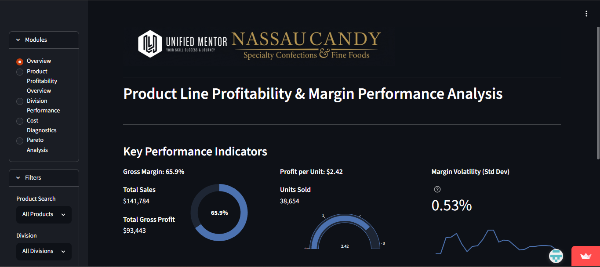<br/><b>Overview</b></td>
    <td align="center">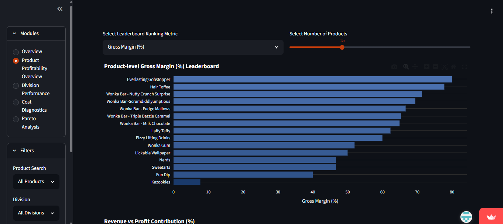<br/><b>Product Profitability Overview</b></td>
  </tr>
  <tr>
    <td align="center">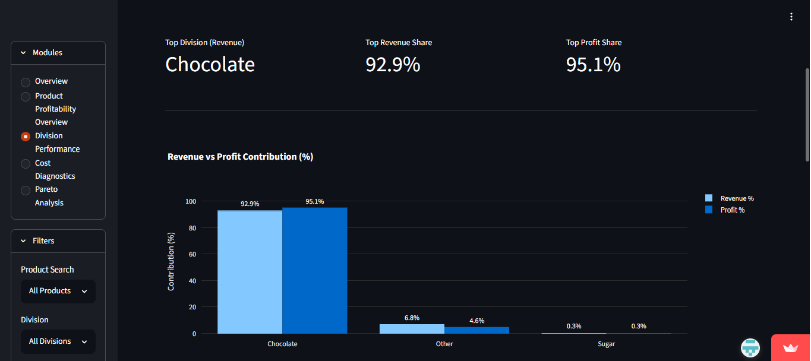<br/><b>Division Performance</b></td>
    <td align="center">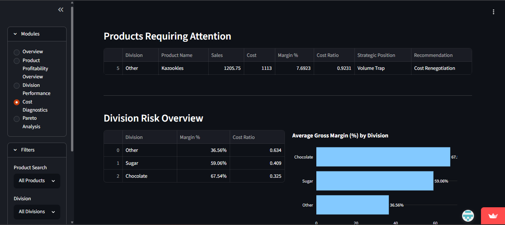<br/><b>Cost Diagnostics</b></td>
  </tr>
  <tr>
    <td align="center" colspan="2">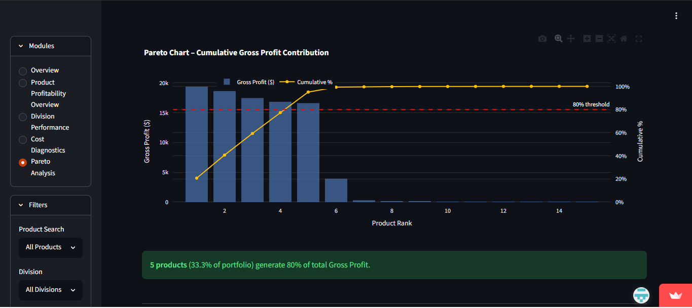<br/><b>Pareto Analysis</b></td>
  </tr>
</table>

---

## 📉 Exploratory Data Analysis

Representative visuals from the EDA notebook (`20260125_Nassau_Candy_Distributor.ipynb`):

<table>
  <tr>
    <td align="center">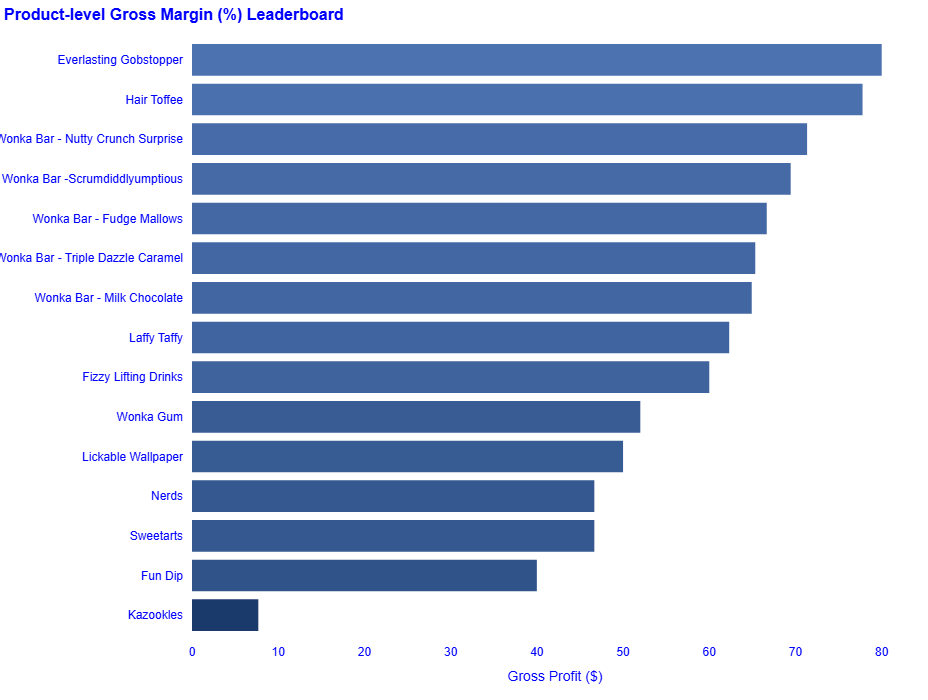<br/><b>Gross Margin Distribution</b></td>
    <td align="center">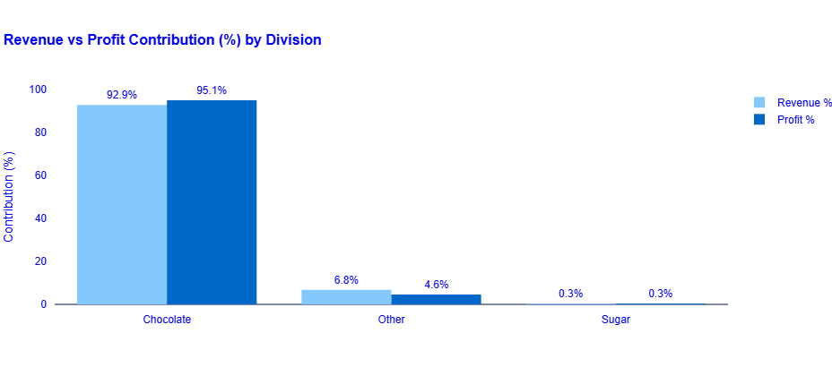<br/><b>Product Portfolio Segmentation</b></td>
  </tr>
  <tr>
    <td align="center">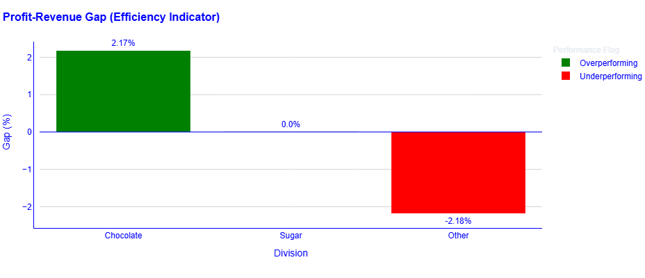<br/><b>Average Margin by Division</b></td>
    <td align="center">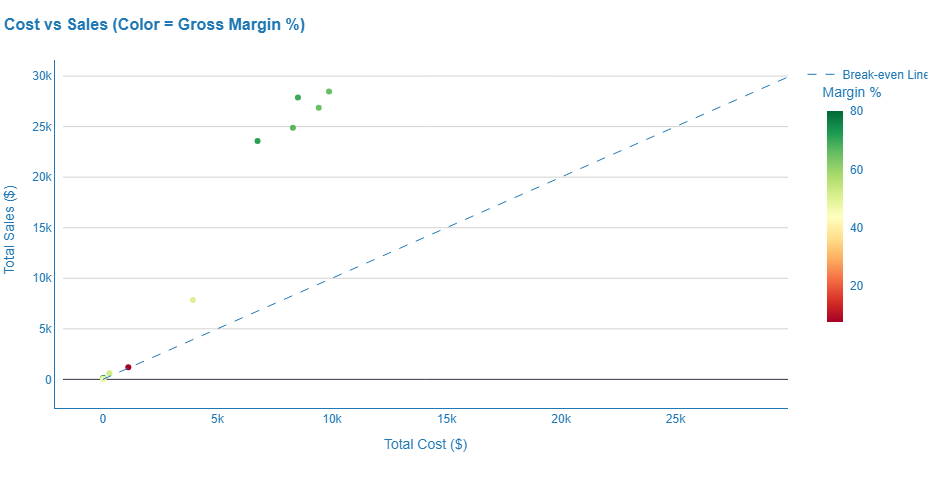<br/><b>Cost Structure Diagnostics</b></td>
  </tr>
</table>

<details>
<summary><b>View all 8 EDA Plots</b></summary>

<br>

<table>
<tr>
<td></td>
<td>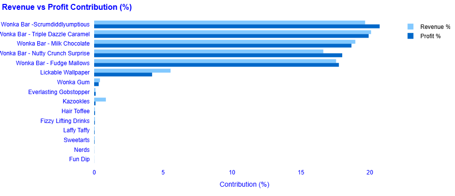</td>
</tr>

<tr>
<td>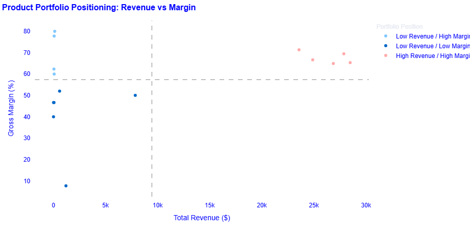</td>
<td></td>
</tr>

<tr>
<td></td>
<td>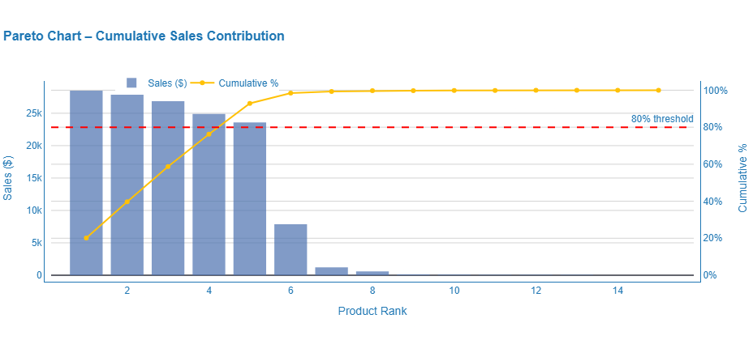</td>
</tr>

<tr>
<td>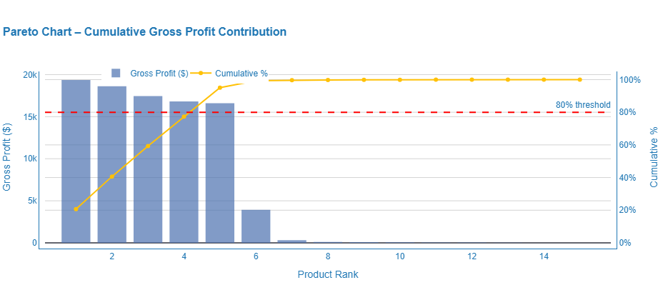</td>
<td></td>
</tr>
</table>

</details>

---

## 🔑 Key Business Insights

> **~67% Portfolio Gross Margin** — driven by the Chocolate division
> **92.9% of Revenue** comes from Chocolate — dominant but over-concentrated
> **1 in 3 divisions underperforming** — the *Other* division sits at ~44.8% margin

- **The Chocolate division carries the business.** It accounts for roughly 93% of total revenue and 95% of gross profit, at a gross margin of approximately 67%. Its profit contribution exceeds its revenue share — a sign of genuine efficiency, not just scale.
- **High revenue does not mean high profit.** Several products generate significant sales volume but comparatively little margin — "volume traps" that look healthy on a revenue dashboard while quietly diluting overall profitability.
- **The 'Other' division has a structural margin problem.** At roughly 45% gross margin — more than 20 points below Chocolate — it generates about 6.8% of revenue but only 4.6% of profit, with a persistently negative profit-revenue gap.
- **Profit is heavily concentrated.** A Pareto analysis confirms that a small subset of products (around 4 of 15, roughly 27%) is responsible for close to 80% of both revenue and profit — a strong efficiency signal, but also a concentration risk.
- **Kazookles is a near-break-even outlier.** With a cost-to-sales ratio of 0.92, 92 cents of every revenue dollar it earns goes straight back out in manufacturing cost, leaving a gross margin under 8% — flagged as a top cost-renegotiation priority.

---

## 📋 Business Recommendations

| # | Priority | Recommendation |
|---|---|---|
| 1 | Immediate | **Protect top performers** — prioritize investment, inventory, and promotion for products with both high revenue and strong margins. |
| 2 | Immediate | **Address volume traps** — evaluate high-sales, low-margin products for repricing, or scale back volume where pricing flexibility is limited. |
| 3 | Immediate | **Fix Kazookles fast** — begin supplier cost renegotiation, review pricing, or reassess its place in the portfolio at current economics. |
| 4 | Near-term | **Audit the Other division** — commission a focused review of its cost base and pricing structure given the persistent margin gap versus Chocolate. |
| 5 | Near-term | **Reduce concentration risk** — develop margin-positive products in the Sugar and Other divisions to reduce over-reliance on Chocolate. |
| 6 | Ongoing | **Build a margin monitoring habit** — implement regular (ideally monthly) margin reporting at the product and division level to catch erosion early. |

---

## 🛠️ Technology Stack

| Layer | Tools |
|---|---|
| Language | Python |
| Data Wrangling | Pandas, NumPy |
| Exploratory Analysis | Jupyter Notebook, Matplotlib, Seaborn, ydata-profiling |
| Interactive Dashboard | Streamlit |
| Visualization (App) | Plotly (Graph Objects & Express) |
| Deployment | Streamlit Community Cloud |

---

## 📁 Repository Structure

```
Product-Line-Profitability-Margin-Performance-Analysis-for-Nassau-Candy-Distributor/
│
├── assets/
│   └── logo.png
│
├── docs/
│   ├── Executive_Summary.docx
│   ├── Project_PRD.docx
│   └── Research_Paper.docx
│
├── images/
│   ├── 1.png ... 8.png                        # EDA plots
│   ├── Overview.png                           # Dashboard screenshot
│   ├── Product_Profitability_Overview.png     # Dashboard screenshot
│   ├── Division_Performance.png                # Dashboard screenshot
│   ├── Cost_Diagnostics.png                   # Dashboard screenshot
│   └── Pareto_Analysis.png                    # Dashboard screenshot
│
├── 20260125_Nassau_Candy_Distributor.ipynb
├── Nassau_Candy_Distributor.csv
├── streamlit_app.py
├── requirements.txt
└── README.md
```

---

## 📚 Documentation

| Document | Description |
|---|---|
| [Project PRD](docs/Project_PRD.docx) | Full project requirements, methodology, KPIs, and dashboard specifications |
| [Research Paper](docs/Research_Paper.docx) | Detailed analytical write-up covering methodology, results, and recommendations |
| [Executive Summary](docs/Executive_Summary.docx) | Condensed, stakeholder-facing summary of findings and recommendations |

---

## ⚙️ Installation

Clone the repository and install dependencies:

```bash
git clone https://github.com/amrit1426/Product-Line-Profitability-Margin-Performance-Analysis-for-Nassau-Candy-Distributor.git
cd Product-Line-Profitability-Margin-Performance-Analysis-for-Nassau-Candy-Distributor
pip install -r requirements.txt
```

---

## ▶️ Running the Application

Once dependencies are installed, launch the dashboard locally:

```bash
streamlit run streamlit_app.py
```

The app will open in your browser at `http://localhost:8501`. It loads the dataset directly from the repository's raw GitHub URL, so no local data setup is required.

---

## 🙏 Acknowledgements


This project was completed as part of the **Data Analyst Internship Programme at Unified Mentor**.

---

## 📬 Contact

**Amrit Baruah**
📧 abaruah289@gmail.com
🔗 [GitHub](https://www.linkedin.com/in/amrit1426)
🔗 [LinkedIn](https://www.linkedin.com/in/amrit1426)

---

<div align="center">

*If you found this project useful or interesting, consider giving the repository a ⭐*

</div>
